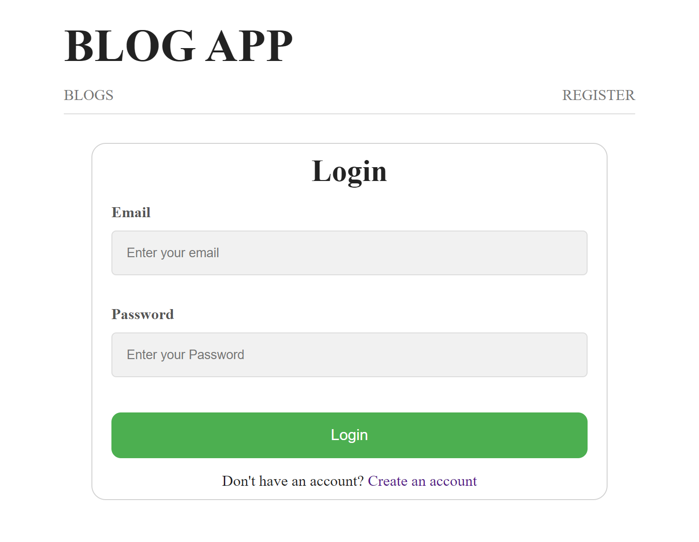
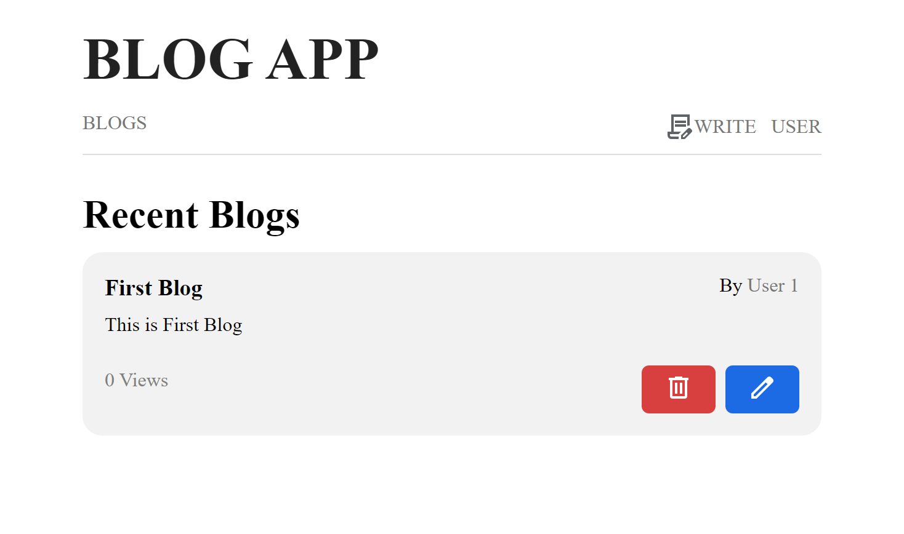
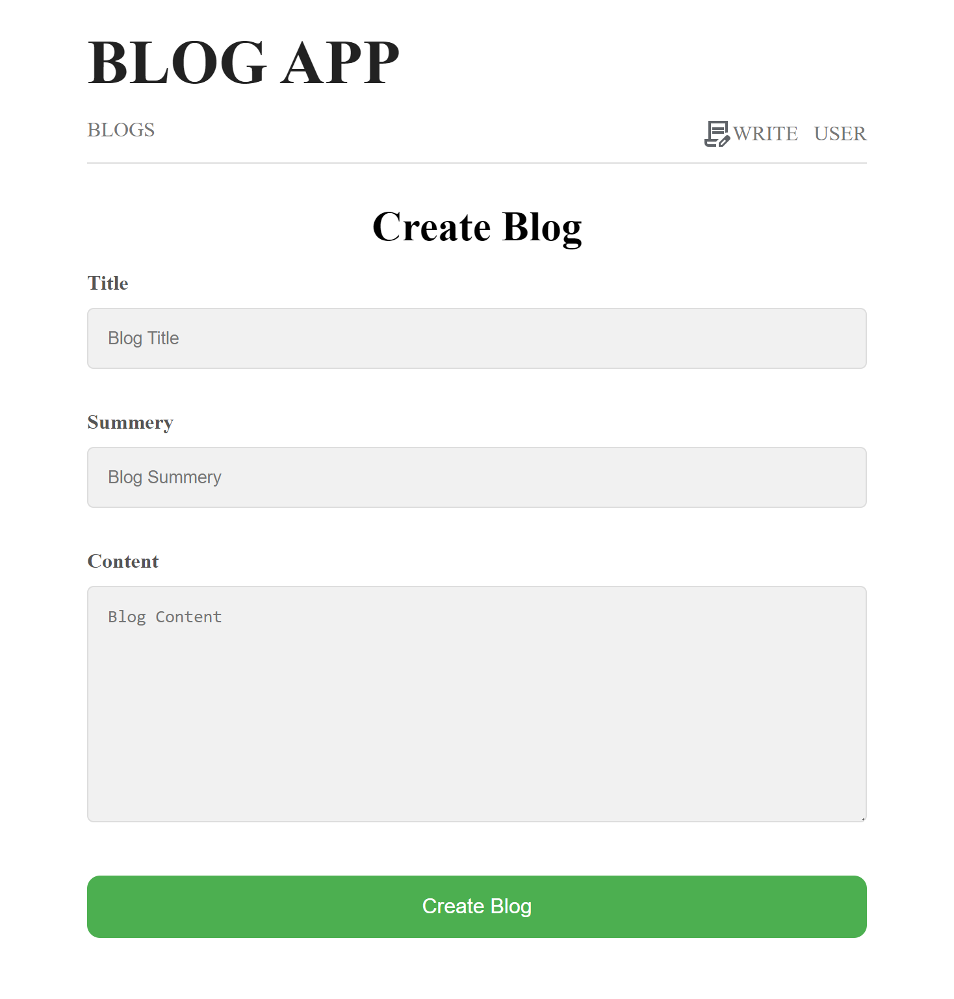
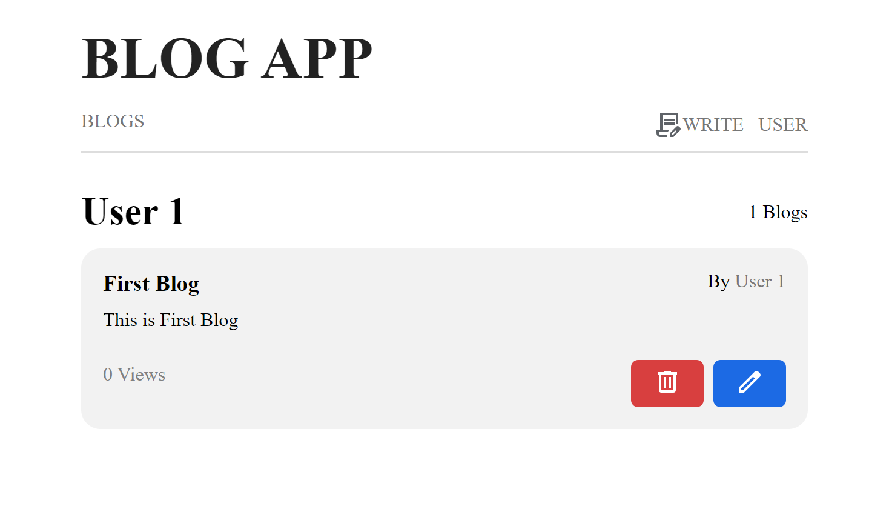

# Blog App

## Documentation

Blog application is a web based app that allows user to write blogs.

At the core of the application is Node.js, a robust and versatile JavaScript runtime. Node.js allows us to build a fast, scalable server-side environment, ensuring app can handle numerous tasks and users simultaneously with high performance.

Express.js is used for the efficient handling of HTTP requests and routing, making the app both powerful and flexible.

For the front end, EJS is used. EJS is a templating engine that allows us to generate HTML markup with plain JavaScript. EJS makes it easy to create dynamic, reusable components and deliver a seamless user experience by rendering server-side content efficiently.

Data layer is powered by MongoDB, a leading NoSQL database. MongoDB offers a flexible schema design and high performance for handling large volumes of data, ensuring that your tasks are stored securely and retrieved quickly.

JWT(Json Web Token) is used for authentication and session management.

## Features
- Create, Update and Delete Blogs
- MongoDb is used to store data
- JWT (Json Web Token) for authentation

## Getting Started

Clone the project

```bash
  git clone https://github.com/manishgupta0/blog-app-node.git
```

Go to the project directory

```bash
  cd blog-app-node
```

Install the packages

```bash
  npm install / npm i
```

Rename env file to .env and set values in file

Start the server

```bash
    node app.js / nodemon app.js
```
## Screenshots








## Key Technologies
- [node.js](https://nodejs.org/en)
- [express.js](https://expressjs.com/)
- [EJS (Embedded JavaScript)](https://ejs.co/)
- [mongoDb](https://www.mongodb.com/)
- [mongoose](https://mongoosejs.com/)
- [jwt (Json Web Token)](https://jwt.io/)
- [nodemon](https://nodemon.io/)